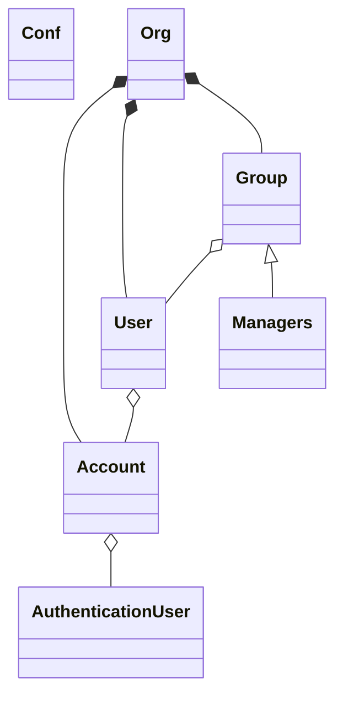
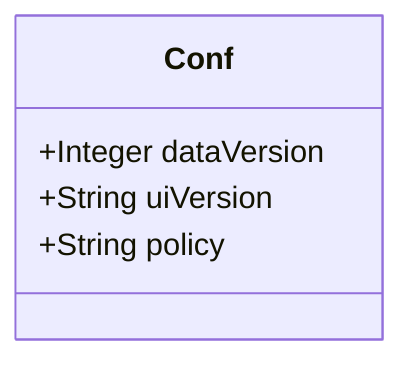
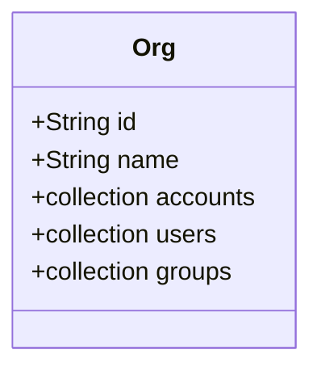
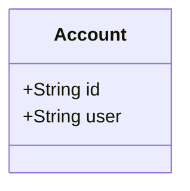
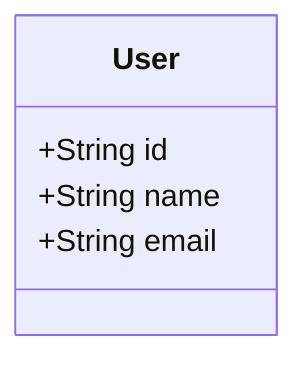
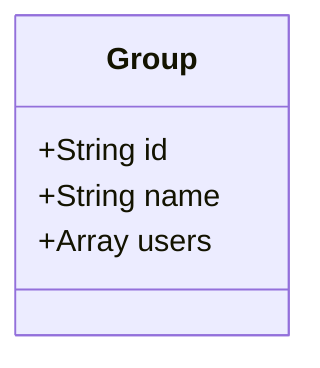

# データ構造

[目次](index.md) に戻る

## collection: `service`

アプリの共通設定。
唯一の `service/conf` ドキュメントを持つ。

- `dataVersion`: このアプリのデータのバージョン。配置時に設定する。
- `uiVersion`: このアプリのUIのバージョン。配置時に設定し、UIのアップデートの要否の判定に用いる。
- `policy`: このアプリのプライバシーポリシーとして、システム管理者が設定する。

## collection: `orgs`

このアプリを利用する組織。
組織の配下にその組織の利用者やグループを持つ。

`id: admins` にはこのアプリを管理する特権を持つメンバー「システム管理者」を格納する。

## collection: `orgs/[id]/accounts`

組織のメンバーのアカウント。
通常、アプリのUIからは見えない属性を持つ。
1人のメンバーが組織内の複数のアカウントを持つことができる。
1人のメンバーが異なる組織のアカウントを持つことができる。

- `id`: Firebase Authentication の `uid` と同じもの。
- `user`: 組織のユーザの `id` 。

## collection: `orgs/[id]/users`

組織のユーザ。
組織内に共有する属性を持つ。
1人のメンバーは、組織内では1個のユーザで表現される前提。
1人のメンバーが、異なる組織のユーザとなることができる。

## collection: `orgs/[id]/groups`

組織のグループ。

- `users`: グループに所属するユーザの `id` の配列。

`id: managers` にはその組織を管理する特権を持つメンバー「組織管理者」を格納する。

## 検討事項

追加検討中の機能のデータを除き、無し。
